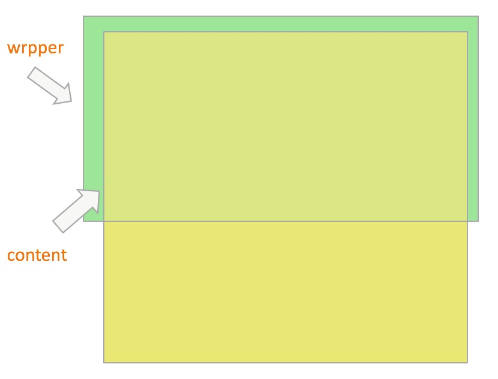

> 毕业后的第一篇文章，献给better-scroll。

如果你是做移动端需求的FE，说到`better-scroll`（以下称`BS`）,可能已经耳濡目染了。`BS`是一款用于解决移动端滚动场景的库，目前拥有1.2w的star量，是前端业内比较火的库。我目前的工作是做H5的，同时组内开源UI库`cube-ui`依赖于`BS`，最重要的`BS`的维护者大佬们在我们组，所以学习一下`BS`是非常有必要的了。本系列文章以当下可用的版本`v1.15.2`进行分析，此外`v2.0.0`已经进入`beta`版本，大家感兴趣可以自行了解下😁。

**何为滚动？**

对于移动端用户来说，应用的用户体验以及性能极为重要，由于用户与应用接触最多的是手指，因此手指与应用间的触感以及滑动体验就需要额外加强，当然触感是用户所使用物理设备自身的属性，我们是无法改变的，所以我们就需要在滑动体验上做文章。那么何为滚动呢？应用界面的内容呈现在手机视窗内，当内容足够多展示不完全的时候就会分为两部分：一部分是用户可见的，另一部分是用户不可见的，而不可见的那部分就需要我们用手指滚动界面将不可见的部分滚动到视窗内，这样就可以看到了。当然如果内容很少，视窗部分就足够展示全部，就谈不上滚动了。

<center>

 

</center>

**BS滚动原理**

如果你使用过`BS`，你应该看到过这样的结构：
```html
<div class="scroll-wrapper">
    <div class="scroll-content">
</div>
```
`BS`把`scroll-wrapper`这个元素当做视窗，也就是用户能够看到的区域，它是定高的；第一个子元素`scroll-content`被称为`scroller`作为内容区，`scroller`才是真正要滚动的地方。在`BS`中只有当`scroller`的高度或者宽度超过`scroll-wrapper`的高度或者宽度的时候才会出现纵向或者横向的滚动。是不是与上述说何为滚动类似呢？借用官网的一张图来表示一下。


这其实就是`BS`的原理了，通过基本滚动的原理来实现复杂滚动场景。