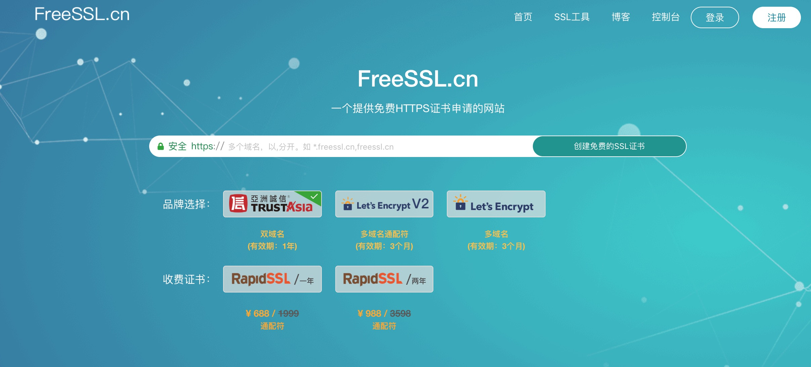
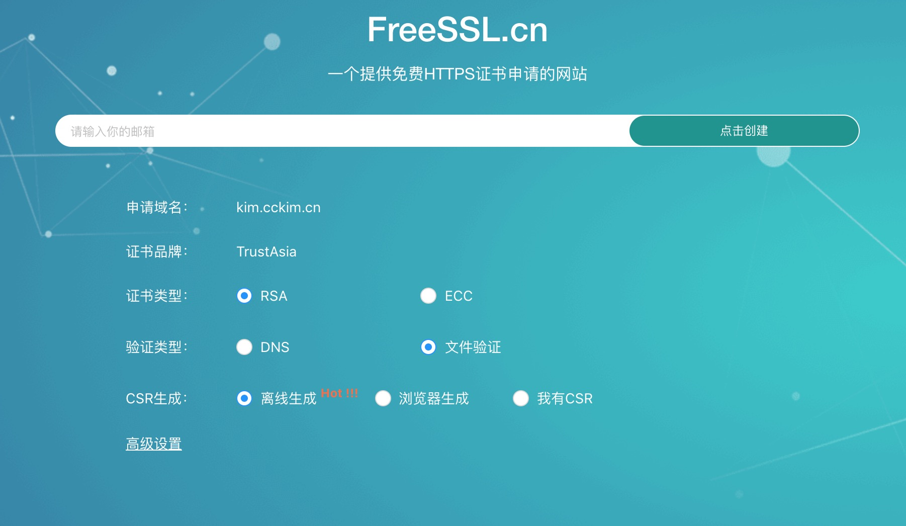
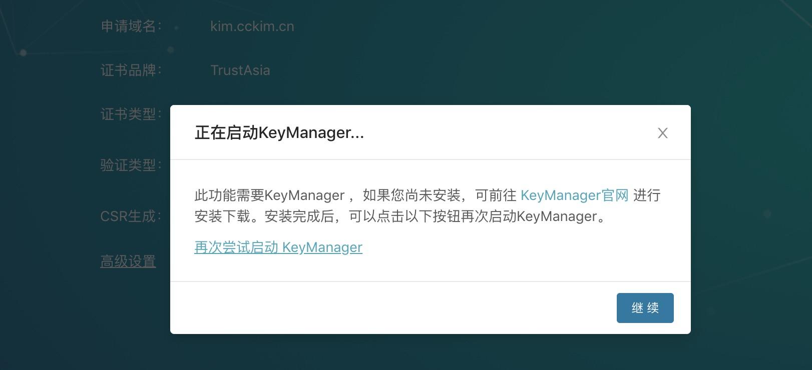
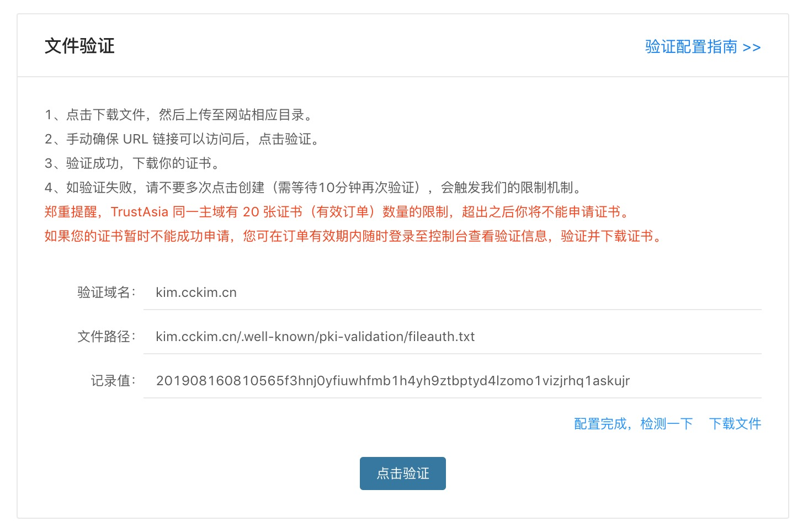
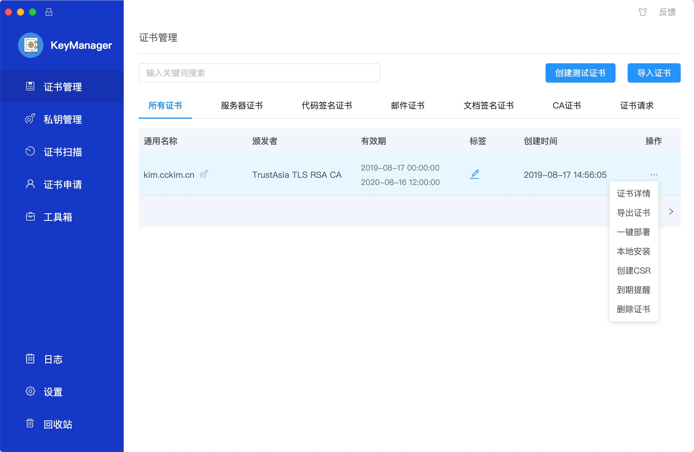
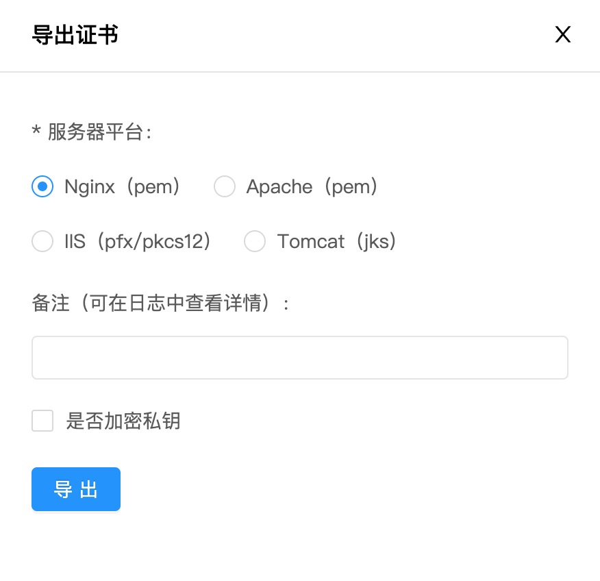
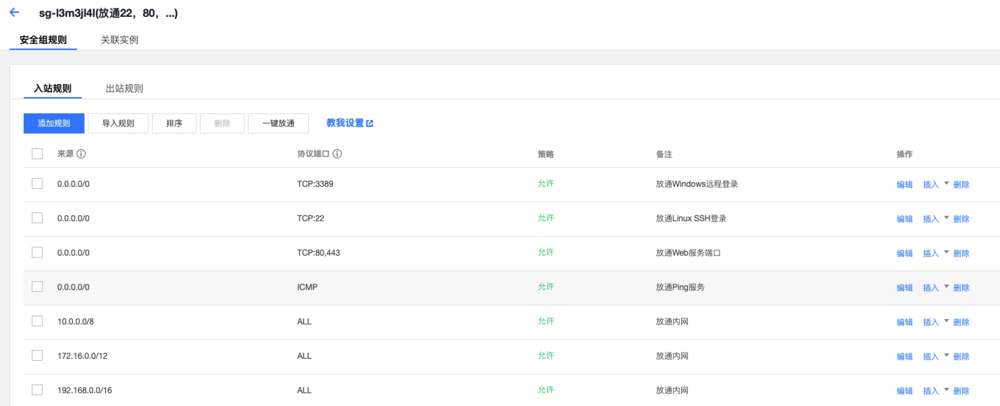

# 前言
目前大多数网站都是在用的HTTPS，为什么要用HTTPS大家一定是都知道的，从HTTP升级到HTTPS，也是为网站的安全性来考虑的。HTTPS是在HTTP的基础上加上了SSL安全认证，是正所谓HTTPS=HTTP + SSL。为了方面自己写文章，相信大多数同学都有搭建自己的个人博客(自己纯手写或者使用静态模板)，大多数应该是服务在自己的Nginx服务上或者使用Github托管，使用Nginx做代理的起初是通过HTTP来访问的，所以需要自己手动去配置成HTTPS的。

**至于为什么推动我去做这件事情？原因有三点**
1. 当下HTTPS很流行
2. 自己搭建的网站当然要为网站的安全性考虑 
3. 在面试过程中面试官问到了我HTTPS相关知识，并且是怎么从HTTP升级到HTTPS的

# Start
## 如何来获得证书
搭建HTTPS需要用到SSL证书，这个证书是由CA认证机构来颁发的，一般都是需要RMB的，当然也有一些免费的。[FreeSSL](https://freessl.cn/)就是一个提供免费HTTPS证书申请的网站，笔者就是从这上面申请的。

首先进入这个网站的首页

可以看到有一个搜索框和一个(创建免费的SSL证书字样)按钮。在搜索框中输入你的域名，点击按钮进入证书创建页面。

在这里选择证书类型，笔者选择的就是图片上的。在验证类型上面，因为是第一次踩坑，第一次选择了DNS，后续的认证没有通过，通过Google和看大佬们的踩坑日记之后，发现文件验证更过过一些，所以就尝试去选择文件验证。

CSR生成因为官网推荐，所以就选择了离线生成。

输入邮箱之后点击创建，点击之后会提示打开KeyManager，这个是用来管理证书的，如果自己电脑上没有可以去点进去官网下载。

如果已经安装好了，点击*再次尝试启动KeyManager*，就会启动这个应用，开启启动因为这是一个管理私密信息的平台，所以让你输入密码，进去之后就会提示*CSR生成成功，请返回浏览器继续操作*。回到浏览器之后点击继续就会看到这样一个东西。

这是用来验证你的网站是否是可访问的。按照步骤验证即可
1. 先点击右下角的下载文件
2. 将文件保存在你的网站根目录的*.well-known/pki-validation*目录下，可以按照文件路径来配置。
3. 存在好之后自己在浏览器中访问一下是否是可访问的，可以访问就配置完成了。
4. 点击验证。

验证通过之后就会看到证书信息，你看到的应该和这个不太一样(应该是有个通过KeyManager管理的按钮)


点击使用KeyManager管理，就可以使用那个管理平台来管理你的证书了。

进入KeyManager证书管理就会看到你的证书。

点击导出证书，选择相应的服务器，笔者是使用的Nginx服务器，选择Nginx就可以，点击导出就可以获得SSL证书。


## 如何来配置Nginx HTTPS
第一步获得证书已经完成，下面就需要进行配置了。服务器配置主要分为以下几步：
1. 将证书传送到你的服务器上
2. 修改nginx.conf文件配置
3. 云服务器443端口开发
4. http重定向到https
5. 测试访问完成

### 1、将证书传送到你的服务器上
笔者是使用的腾讯云的服务器(阿里云也可以，都是学生价，便宜)，建议将证书放在便于管理的地方，建议放在`/etc/ssl`下，看名字也知道是用来存在ssl证书的。

将证书传入到服务器上可以使用Linux的`scp`命令

```sh
#如果是文件
scp 你的ssl证书文件  root@你的服务器ip:/etc/ssl
# 如果是文件夹
scp -r 你的ssl证书文件夹 root@你的服务器ip:/etc/ssl
```
如果传的是文件，进入服务器上进行解压，解压完成之后，就会得到两个文件：一个是`crt`后缀的，一个是`key`后缀的。

### 2、修改nginx.conf文件配置
将证书放在服务器上之后需要去修改nginx.conf配置。因为之前是使用的80端口，但是HTTPS使用的443端口，所以要修改一下。

一般Nginx上都有443端口的配置，但是注释的，只要打开注释修改一点信息即可。

下面是我的443端口的配置。
```sh
server {
    listen       443 ssl http2 default_server;
    listen       [::]:443 ssl http2 default_server;
    server_name  kim.cckim.cn;
    root         /usr/share/nginx/html;

    ssl_certificate "/etc/ssl/xxxxx/xxxxx.crt";
    ssl_certificate_key "/etc/ssl/xxxxx/xxxxx.key";
    ssl_session_cache shared:SSL:1m;
    ssl_session_timeout  10m;
    ssl_ciphers HIGH:!aNULL:!MD5;
    ssl_prefer_server_ciphers on;

    # Load configuration files for the default server block.
    include /etc/nginx/default.d/*.conf;

    location / {
            root    /usr/share/nginx/html/public;
            index   index.html;
    }

    error_page 404 /404.html;
        location = /40x.html {
    }
}
```
将所有的注释打开，下面说一下需要修改的地方
1. server_name：如果要443端口和80端口并存的话，建议写上server_name，当命中这个域名的时候就会来找这个server配置。
2. ssl_certificate：将ssl证书里面的crt后缀的文件的绝对路径写在这里。
3. ssl_certificate_key：将ssl认证里面的key后缀的文件的绝对路径写在这里。
4. 配置你的网站的location代理。

nginx.conf上443端口的配置就基本完成了

### 3、 云服务器443端口开发
如果你的云服务器上没有开发443端口的话需要去服务器平台的安全组中开发443端口。


操作完成之后就先访问一下，可能你会发现在浏览器中输入`kim.cckim.cn`(输入你的域名)是是无法访问的，但是输入`https://kim.cckim.cn`(还是输入你的域名)就可以访问。

是因为域名到nginx默认走的是http，还需要对http做一下重定向到https上。

### 4、http重定向到https
重定向只需要在nginx.conf文件中配置一下即可。
```sh
server {
    listen       80;
    server_name  kim.cckim.cn;
    return 301 https://$host$request_uri;
}
```
这里server_name写你自己的域名即可。再次直接使用域名访问的话就可以了。

# End
笔者应该是配置HTTPS比较靠后的一批了，相信已经有很多同学完成。这次把自己的配置过程记录向来，希望可以给没有配置过HTTPS的同学一些帮助。