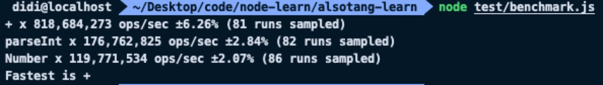

### 前言

随着互联网时代的飞速发展，用户对产品性能越来越关注，特别是服务端程序，一个功能跑几十秒实在是无法忍受，于是总是想尽各种办法去提高性能，也包括 API 层面的选择，当让性能测试是我们选择的重要依据。

### Benchmark

Benchmark 是 Node.js 上比较流行的性能测试工具，其链式调用的 API 也让我们写的更加顺畅，下面来尝鲜一下 Benchmark 做性能测试的乐趣。

假如说我们要做一个字符串转数字使用哪种方式比较快的测试，有三种方式：

- 使用`+`转换
- 使用`parseInt`转换
- 使用`Number`构造函数转换

我们来对上面三个方式写三个方法：

```js
exports.useAdd = str => +str

exports.useParseInt = str => parseInt(str, 10)

exports.useNumber = str => Number(str)
```

**安装 benchmark.js**

> npm install benchmark --save-dev or yarn add benchmark --dev

引入 benchmark 并实例化 Suite 类

```js
const Benchmark = require('benchmark')
const suite = new Benckmark.Suite()
```

开始写测试用例

```js
const { useAdd, useNumber, useParseInt } = require('./string2number.js')
const Benchmark = require('benchmark')
const suite = new Benckmark.Suite()
const number = '100'

//测试用例
suite
  .add('+', () => {
    useAdd(number)
  })
  .add('parseInt', () => {
    useParseInt(number)
  })
  .add('Number', () => {
    useNumber(number)
  })
  .on('cycle', event => {
    //测试跑完输出数据
    console.log(String(event.target))
  })
  .on('complete', function() {
    console.log(`Fastest is ${this.filter('fastest').map('name')}`)
  })
  .run({ async: true })
```

上面在 suite 实例了使用了三个方法，分别是：add、on、run。

- add：add 方法用于将一个测试用例添加到测试数组里面，并且实例化一个 Event 事件。
- on：顾名思义就是用于监听 add 方法实例化的 Event 事件，并且有多重类型，这里写了两个类型：`cycle`和`complete`，cycle 用于监听每一个测试是否跑完，在这里输出单个用例的测试信息；complete 用于监听整体测试是否完成，在这里可以找出执行最快的那一个。
- run：run 方法用于启动测试，之前的工作都是在准备，到这里才开始正式启动，传入`async:true`使用异步的方式启动测试。

**执行测试**

> node benchmark.js

**测试结果**


输出了每个用例的信息，分别执行了 81、82、86 个样本，可以看出使用`+`是最快的。

**end**
