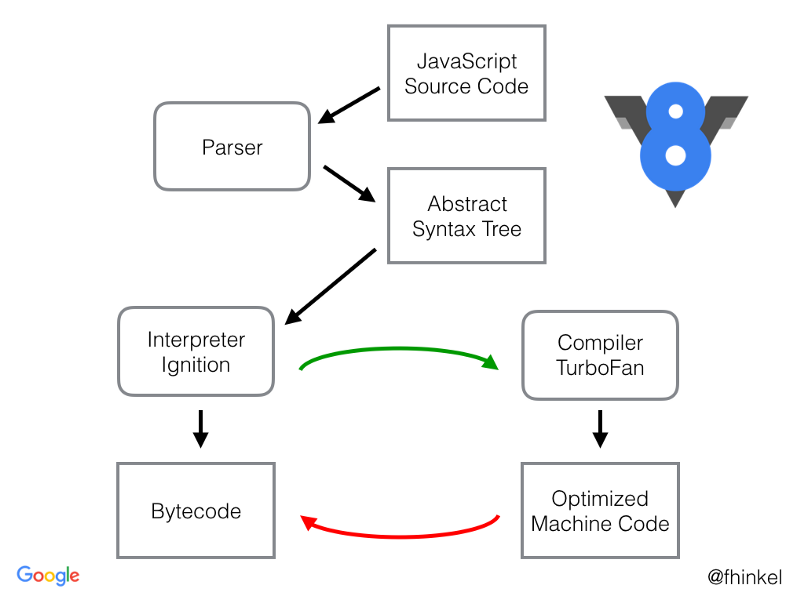
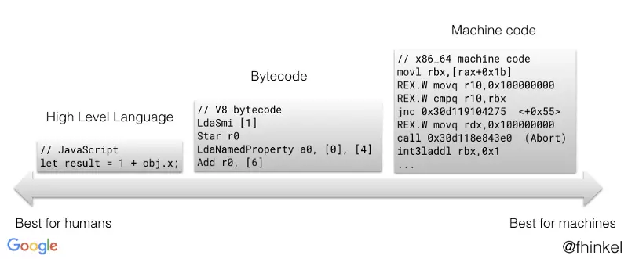

TypeScript 据目前来看基本上是前端开发者的标配，我们可能仅仅知道 TypeScirpt 解决了 JavaScript 在类型上的苦恼，但是对于带给我们更多的底层优化可能熟知甚少，接下来我们就从 V8 内部对类型的优化上来探讨一下为什么要使用 TypeScript 吧。

### V8 引擎解析过程

JavaScript 语言是解释性语言还是编译性语言其实说法都不固定。从内部机制上看，其实 V8 对 JavaScript 是存在编译过程的，反而在`你不知道的js(上)中`有解释到它的编译过程比传统的编译性语言更复杂；从执行的角度上说，首先 JavaScript 需要由引擎才能运行起来，无论是浏览器还是在 Node 中，这是解释性语言的特性。但是在 V8 引擎下，又引入了 TurboFan 编译器，他会在特定的情况下进行优化，把代码编译成执行效率更高的`Machine Code`，也就是机器码。当然这个编译器并不是 JavaScript 编译过程必须要经过的一个步骤，只是为了提高代码的执行效率。

先来一张图


首先 V8 引擎会将 JavaScript 代码解析成 AST（抽象语法树），这个过程是相当慢的，代码越多解析过程的时间耗费就越长。AST 解析结果可以通过[AST](https://astexplorer.net/)来体验一番。

来看下面代码

```js
const a = 123
const fun = () => {
  console.log(a)
}
```

经过 AST 解析

```json
{
  "type": "Program",
  "start": 0,
  "end": 54,
  "body": [
    {
      "type": "VariableDeclaration",
      "start": 0,
      "end": 14,
      "declarations": [
        {
          "type": "VariableDeclarator",
          "start": 6,
          "end": 13,
          "id": {
            "type": "Identifier",
            "start": 6,
            "end": 7,
            "name": "a"
          },
          "init": {
            "type": "Literal",
            "start": 10,
            "end": 13,
            "value": 123,
            "raw": "123"
          }
        }
      ],
      "kind": "const"
    },
    {
      "type": "VariableDeclaration",
      "start": 15,
      "end": 53,
      "declarations": [
        {
          "type": "VariableDeclarator",
          "start": 21,
          "end": 53,
          "id": {
            "type": "Identifier",
            "start": 21,
            "end": 24,
            "name": "fun"
          },
          "init": {
            "type": "ArrowFunctionExpression",
            "start": 27,
            "end": 53,
            "id": null,
            "expression": false,
            "generator": false,
            "async": false,
            "params": [],
            "body": {
              "type": "BlockStatement",
              "start": 33,
              "end": 53,
              "body": [
                {
                  "type": "ExpressionStatement",
                  "start": 36,
                  "end": 51,
                  "expression": {
                    "type": "CallExpression",
                    "start": 36,
                    "end": 50,
                    "callee": {
                      "type": "MemberExpression",
                      "start": 36,
                      "end": 47,
                      "object": {
                        "type": "Identifier",
                        "start": 36,
                        "end": 43,
                        "name": "console"
                      },
                      "property": {
                        "type": "Identifier",
                        "start": 44,
                        "end": 47,
                        "name": "log"
                      },
                      "computed": false
                    },
                    "arguments": [
                      {
                        "type": "Identifier",
                        "start": 48,
                        "end": 49,
                        "name": "a"
                      }
                    ]
                  }
                }
              ]
            }
          }
        }
      ],
      "kind": "const"
    }
  ],
  "sourceType": "module"
}
```

经过 AST 解析之后，Ignition 负责将 AST 转换成 Bytecode(字节码),TurboFan 负责编译出优化后的 Machine Code，并且 Machine Code 在执行效率上优于 Bytecode。



最后就可以执行了。

### 什么情况下会经过 TurboFan 编译成 Machine Code

在整过解析流程中，会在特定的条件下通过 TruboFan 编译成 Machine Code，那么这个特定条件是什么呢？

JavaScript 语言是一门动态的语言，动态性是指在 JavaScript 语言中变量是不存在类型可言的，类型是值的内部特征，而变量只是承载值的载体，因此一个变量可以承载任意变量的值。

由于动态性，JavaScript 在内部执行的时候，存在着一大堆的规则。比如说简单的加法运算规则就存在好几种：数字相加、字符串相加、对象和字符串相加等等，其内部隐式类型转换的复杂程度就更不要说了。这样的情况也就在很大程度上在内部增加了复杂的判断逻辑，从而降低代码性能。

```js
function test(x) {
  return x + x
}
test(1)
test(2)
test(3)
test(4)
```

对于上面代码来说，如果函数被多次调用并且一直传入`number`类型，那么 V8 就会将这段代码编译成 Machine Code，因为固定了类型，内部不需要做太多的判断逻辑了。

但是如果一旦我们传入的参数类型改变，那么 Machine Code 就会被 DeOptimized 为 Bytecode，会造成性能损耗。因此如果我们希望代码都能被编译成 Machine Code，那么就应该在写代码的时候保持类型一致。

### TypeScript 带来的小美好

由于 JavaScript 动态类型不固定的缺陷，导致我们很难去享受 Machine Code 带来执行上的快感，TypeScript 的出现为开发者带来了福音。

TypeScript 在我们编写代码的时候就约束类型。

```ts
let num: number = 123
```

上面代码此时就是`number`类型，如果我们对 num 赋值一个 string，在编译器上就会抛出错误，能够做到很好的提醒我们。

不仅如此，除了以上 Ts 对 type 上面带给我们的福音之外，更多的是它能带给 JavaScript 一种强类型语言的能力，可以让我们去写 Interface、泛型等等，可能更好的基于 SOLID 的设计原则去组织代码架构。
