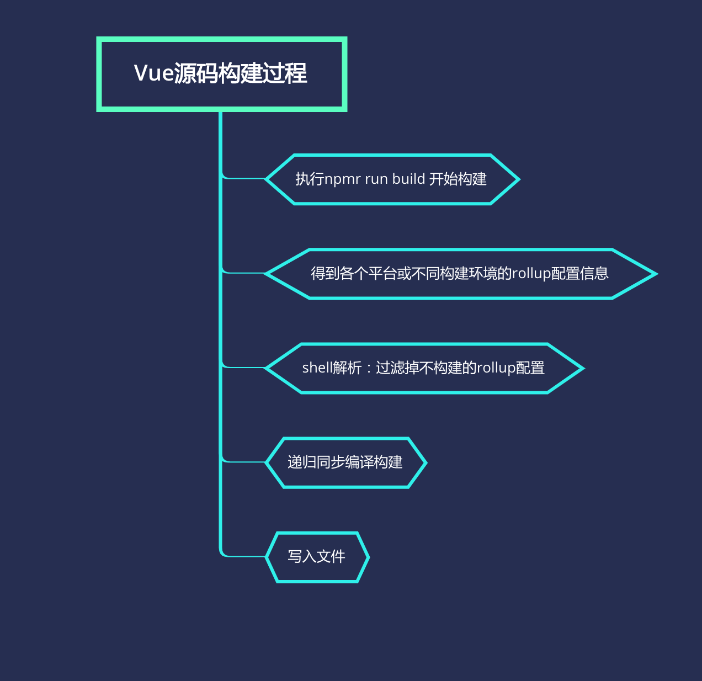

### 整体 build 过程

1. 执行 npm run build
2. 得到各平台的 rollup 配置信息
3. 通过终端传入的构建平台或环境，过滤掉不需要构建的平台配置
4. 递归同步构建
5. 写入文件



### build

> npm run build

执行命令，会定位到 scripts 下的 build 文件，下面来看一下这个文件中做了什么。

首先会判断有没有 dist 目录，这是存放构建产出物的地方

```js
if (!fs.existsSync('dist')) {
  fs.mkdirSync('dist')
}
```

读取 config，获得各个平台或环境的 rollup 配置信息。

```js
let builds = require('./config').getAllBuilds()
```

下面来看一下 config 文件做了什么。

来到 config 定位到 getAllBuilds 方法

```js
exports.getAllBuilds = () => Object.keys(builds).map(genConfig)
```

getAllBuilds 方法返回的是将一个对象的 key 变成数组并 map 映射了一下

`build`它就是存放的打包各个环境或平台的信息

```js
const builds = {
  'web-runtime-cjs-dev': {
    entry: resolve('web/entry-runtime.js'),
    dest: resolve('dist/vue.runtime.common.dev.js'),
    format: 'cjs',
    env: 'development',
    banner
  },
  'web-runtime-cjs-prod': {},
  'web-full-cjs-dev': {},
  'web-full-cjs-prod': {},
  'web-runtime-esm': {},
  'web-full-esm': {},
  'web-full-esm-browser-dev': {},
  'web-full-esm-browser-prod': {},
  'web-runtime-dev': {},
  'web-runtime-prod': {},
  'web-full-dev': {},
  'web-full-prod': {},
  'web-compiler': {},
  'web-compiler-browser': {},
  'web-server-renderer-dev': {},
  'web-server-renderer-prod': {},
  'web-server-renderer-basic': {},
  'web-server-renderer-webpack-server-plugin': {},
  'web-server-renderer-webpack-client-plugin': {},
  'weex-factory': {},
  'weex-framework': {},
  'weex-compiler': {}
}
```

第一个配置中一共有 5 个属性

- entry
- dest
- format
- env
- banner

**entry**

entry 中调用 resolve 方法，resolve 方法通过对 node 的 path.resolve 封装了一下，用于找到构建的入口文件的路径。

```js
const aliases = require('./alias')
const resolve = p => {
  //得到是什么平台：vue有web平台和weex平台
  const base = p.split('/')[0]
  // 通过平台拿到platforms下相应平台的目录，
  if (aliases[base]) {
    //拼接编译入口
    return path.resolve(aliases[base], p.slice(base.length + 1))
  } else {
    return path.resolve(__dirname, '../', p)
  }
}
```

**dest**

dest 中调用 resolve 与 entry 相同，用于找到构建后产出物所在的目录

**format**

format 表示构建完毕产出物的模块化规范是什么，rollup 用 format 来配置，一共有一下几种：

- amd
- cjs
- es
- iife
- umd

**env**

env 表示是以生产环境构建还是以开发环境构建，生产环境会进行代码 gzip 压缩

**banner**

源码往上翻可以看到这样一段代码

```js
const banner =
  '/*!\n' +
  ` * Vue.js v${version}\n` +
  ` * (c) 2014-${new Date().getFullYear()} Evan You\n` +
  ' * Released under the MIT License.\n' +
  ' */'
```

用于在打包好的文件的顶部添加打包信息。

回到 getAllBuilds 的话题，现在已经知道 builds 是什么了，下面调用 map 方法传入 genConfig 对原来的配置做了一下映射。

来看一下 genConfig 做了什么

```js
function genConfig(name) {
  const opts = builds[name]
  // rollup的配置结构
  const config = {
    input: opts.entry,
    external: opts.external,
    plugins: [flow(), alias(Object.assign({}, aliases, opts.alias))].concat(
      opts.plugins || []
    ),
    output: {
      file: opts.dest,
      format: opts.format,
      banner: opts.banner,
      name: opts.moduleName || 'Vue'
    },
    onwarn: (msg, warn) => {
      if (!/Circular/.test(msg)) {
        warn(msg)
      }
    }
  }
```

了解 rollup 的应该都知道，builds 中的配置并不是 rollup 打包的配置信息，所以要把原来的配置映射成 rollup 的配置，genConfig 就是用来做这个的。

**现在已经知道在 build 文件下调用 config 文件中的 getAllBuilds 得到的是什么。**

接下来，拿到 shell 中输入的平台或环境信息，并且把不需要打包的 builds 中的配置过滤掉。

```js
if (process.argv[2]) {
  // 解析shell 参数
  const filters = process.argv[2].split(',')
  //通过shell参数把builds不需要的平台配置过滤掉
  builds = builds.filter(b => {
    return filters.some(
      f => b.output.file.indexOf(f) > -1 || b._name.indexOf(f) > -1
    )
  })
} else {
  // filter out weex builds by default
  builds = builds.filter(b => {
    return b.output.file.indexOf('weex') === -1
  })
}
```

执行 build 函数,开始构建

```js
build(builds)
```

由于存在多个不同或环境的编译构建，vue 采用同步 promise 的方式递归编译。类似于 koa 的中间件逻辑

```js
function build(builds) {
  let built = 0
  const total = builds.length
  // 通过next 调用buildEntry同步编译，built对应builds中平台入口的索引，当一个编译完成之后，built++，继续启动next调用下一个。
  const next = () => {
    buildEntry(builds[built])
      .then(() => {
        built++
        if (built < total) {
          next()
        }
      })
      .catch(logError)
  }

  next()
}
```

其中调用 buildEntry，它是每一次构建入口，在这里会判断是否是生产环境从而在构建过程中使用 terser 压缩。

```js
function buildEntry(config) {
  const output = config.output
  // file是打包的入口
  const { file, banner } = output
  //isProd 判断是否是生产环境的编译
  const isProd = /(min|prod)\.js$/.test(file)
  return rollup
    .rollup(config)
    .then(bundle => bundle.generate(output))
    .then(({ output: [{ code }] }) => {
      // terser是一个适用于ES6压缩代码的工具，在生产环境对代码进行压缩
      if (isProd) {
        const minified =
          (banner ? banner + '\n' : '') +
          terser.minify(code, {
            toplevel: true,
            output: {
              ascii_only: true
            },
            compress: {
              pure_funcs: ['makeMap']
            }
          }).code
        return write(file, minified, true)
      } else {
        return write(file, code)
      }
    })
}
```

构建完毕之后最终调用 write 方法写入文件,在写入文件过程中会判断是否是生产环境的构建对产出物进行 gzip 压缩。

```js
function write(dest, code, zip) {
  return new Promise((resolve, reject) => {
    function report(extra) {
      console.log(
        blue(path.relative(process.cwd(), dest)) +
          ' ' +
          getSize(code) +
          (extra || '')
      )
      resolve()
    }
    // 将编译好的文件写入相应的目录下
    fs.writeFile(dest, code, err => {
      if (err) return reject(err)
      if (zip) {
        //gzip压缩
        zlib.gzip(code, (err, zipped) => {
          if (err) return reject(err)
          report(' (gzipped: ' + getSize(zipped) + ')')
        })
      } else {
        report()
      }
    })
  })
}
```

至此整个编译过程完毕。
