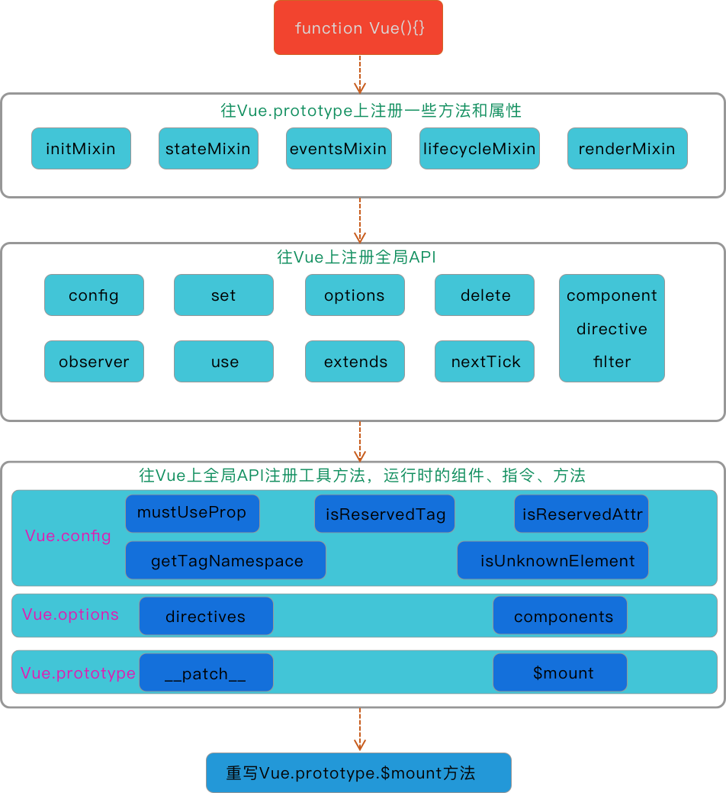

本文主要深入源码分析我们在`new Vue()`之前 Vue 到底做了哪些事情。

## Vue 加载的两种方式

首先说一个 Vue 有两种加载方式：

- Runtime Only
- Runtime + Compiler

这两种方式有什么不同呢？

**Runtime Only**

使用 Runtime Only 版本的时候，通常我们需要借助于 webpack 的 vue-loader 工具将`.vue`文件编译成 JavaScript。因此 vue 的 template 编译操作是在 webpack 构建过程中做的，所以最后打包出来的代码中只有运行时所需要的 vue 代码，即代码的体积也会小很多。

**Runtime + Compiler**

使用 Runtime + Compiler 版本，如果没有对代码进行预编译但又使用了 Vue 的 template 属性传入了一个字符串，那么则需要在运行时编译 template 为 render 函数，即这个版本的 Vue 编译 template 是在运行时发生的。

本文主要以`Runtime + Compiler`版本的源码进行分析。

## 入口文件

从 Vue 的编译入口可以找到`Runtime + Compiler`版本的入口文件为`platforms/web/entry-runtime-with-compiler.js`。

文件内容部分如下：

```js
import config from 'core/config'
import { warn, cached } from 'core/util/index'
import { mark, measure } from 'core/util/perf'
import Vue from './runtime/index'
import { query } from './util/index'
import { compileToFunctions } from './compiler/index'
import {
  shouldDecodeNewlines,
  shouldDecodeNewlinesForHref
} from './util/compat'

const idToTemplate = cached(id => {
  const el = query(id)
  return el && el.innerHTML
})

const mount = Vue.prototype.$mount
Vue.prototype.$mount = function(el, hydrating): Component {}
function getOuterHTML(el: Element): string {}
Vue.compile = compileToFunctions
export default Vue
```

快速扫一遍，我们发现只是往 Vue 的 prototype 上挂载了一个\$mount 方法，并且导出了 Vue。

我们继续根据 Vue 的来源，发现`'./runtime/index'`文件中引入。

在`'./runtime/index'`中发现 Vue 从`core/index`中引入。

```js
import Vue from 'core/index'
```

继续追踪。

在`core/index`中发现 Vue 从`./indextance/index`中引入

```js
import Vue from './instance/index'
```

继续追踪。

打开`'./instance/index'`，终于不需要追踪了。

```js
function Vue(options) {
  if (process.env.NODE_ENV !== 'production' && !(this instanceof Vue)) {
    warn('Vue is a constructor and should be called with the `new` keyword')
  }
  // _init方法在initMixin中绑定在Vue.prototype上
  this._init(options)
}
```

我们在`./instance/index`中找到了 Vue 构造函数的定义位置。

我们上面所做的一些事情都是在找 Vue 构造函数在哪里定义。既然找到了，那么下面来看一下它到底做了什么？

## 到底做了什么

直接打开代码。

```js
function Vue(options) {
  if (process.env.NODE_ENV !== 'production' && !(this instanceof Vue)) {
    warn('Vue is a constructor and should be called with the `new` keyword')
  }
  this._init(options)
}
initMixin(Vue)
stateMixin(Vue)
eventsMixin(Vue)
lifecycleMixin(Vue)
renderMixin(Vue)
```

从上面代码中可以看出，定义完 Vue 构造函数之后，就直接执行了 5 个 Mixin 方法。接下来看一下这 5 个 Mixin 中做了什么

**initMixin**

```js
export function initMixin(Vue: Class<Component>) {
  Vue.prototype._init = function(options?: Object) {}
}
```

向 Vue.prototype 上绑定了一个`_init`方法，用于在 new Vue 的时候初始化`options`。

**stateMixin**

```js
export function stateMixin(Vue: Class<Component>) {
  Object.defineProperty(Vue.prototype, '$data', dataDef)
  Object.defineProperty(Vue.prototype, '$props', propsDef)
  Vue.prototype.$set = set
  Vue.prototype.$delete = del
  Vue.prototype.$watch = function() {}
}
```

向 `Vue.prototype` 上绑定了`$data`和`$props` 属性已经`$set`、`$delete` 和`$watch` 方法。

**eventsMixin**

```js
export function eventsMixin(Vue: Class<Component>) {
  const hookRE = /^hook:/
  Vue.prototype.$on = function(event, fn) {}
  Vue.prototype.$once = function(event, fn) {}
  Vue.prototype.$off = function(event, fn) {}
  Vue.prototype.$emit = function(event) {}
}
```

向`Vue.prototype`上绑定了事件相关的方法，也可以说在 Vue 上实现了一个订阅发布者模式。

**lifecycleMixin**

```js
export function lifecycleMixin(Vue: Class<Component>) {
  Vue.prototype._update = function(vnode, hydrating) {}
  Vue.prototype.$forceUpdate = function() {}
  Vue.prototype.$destroy = function() {}
}
```

向`Vue.prototype`上绑定一些更新和生命周期相关的方法：`_update`、`$forceUpdate`、`$destory`。

**renderMixin**

```js
export function renderMixin(Vue: Class<Component>) {
  Vue.prototype.$nextTick = function(fn: Function) {
    return nextTick(fn, this)
  }
  Vue.prototype._render = function(): VNode {}
}
```

## 未完待续

## 总结

一张图来总结一下整体流程。

