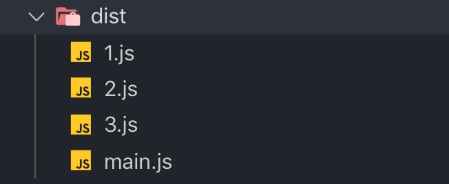
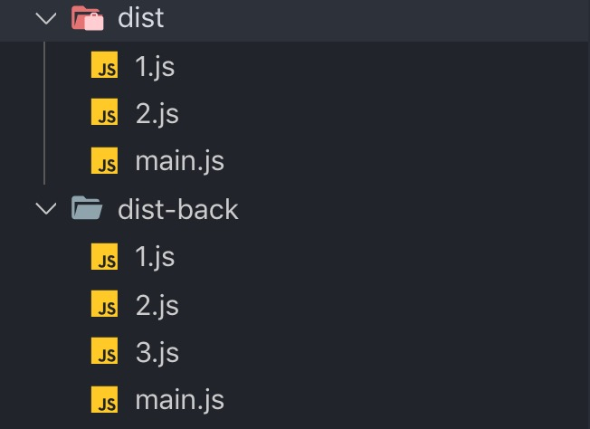
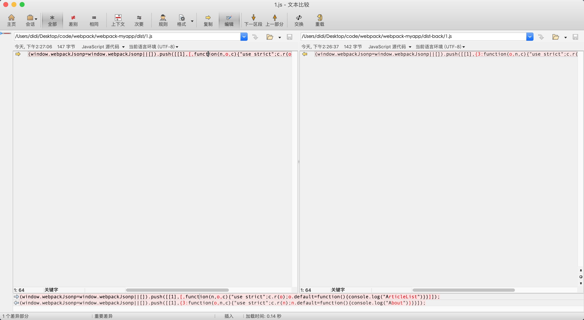
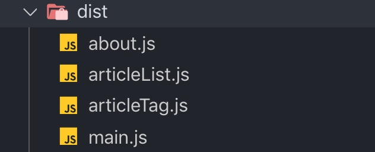
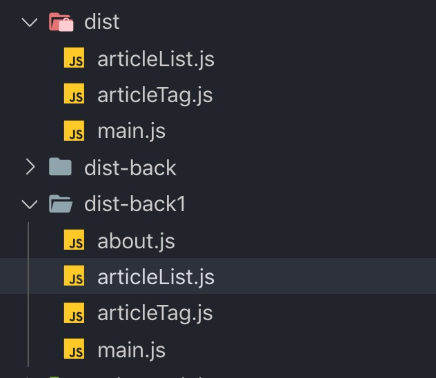
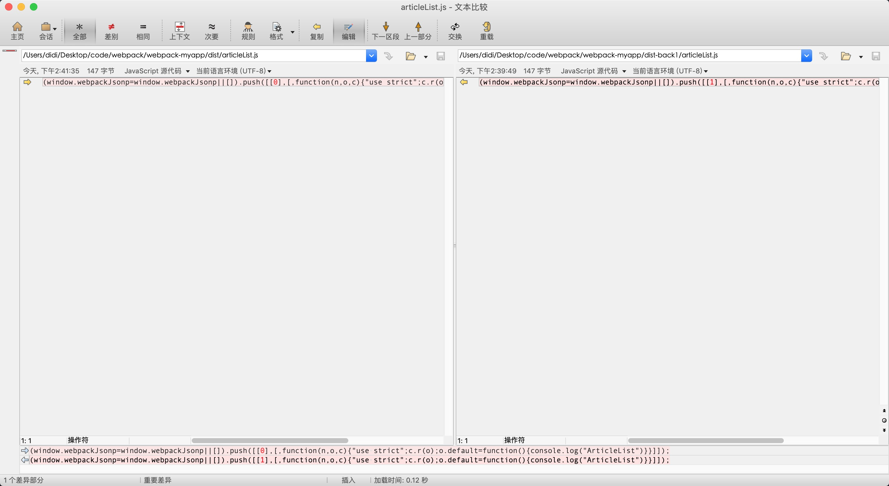
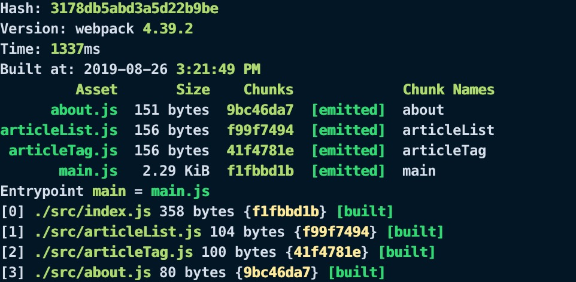
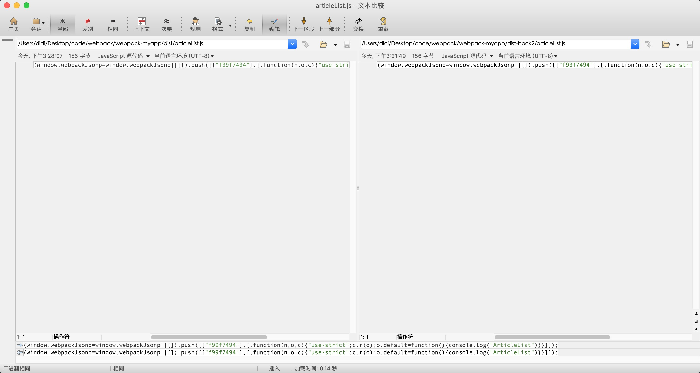
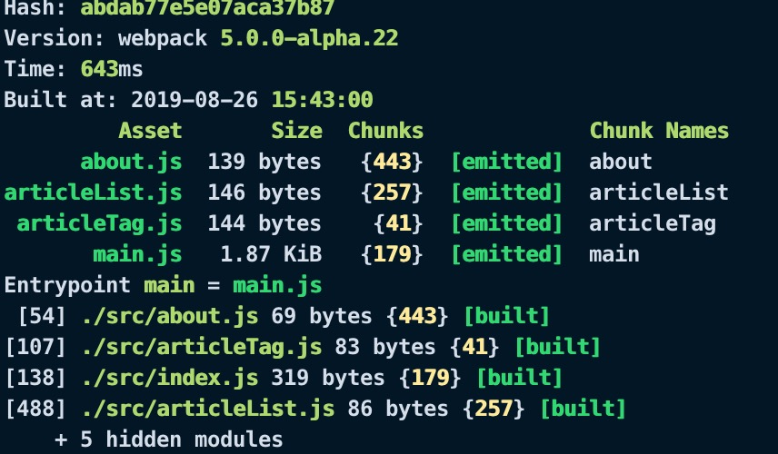
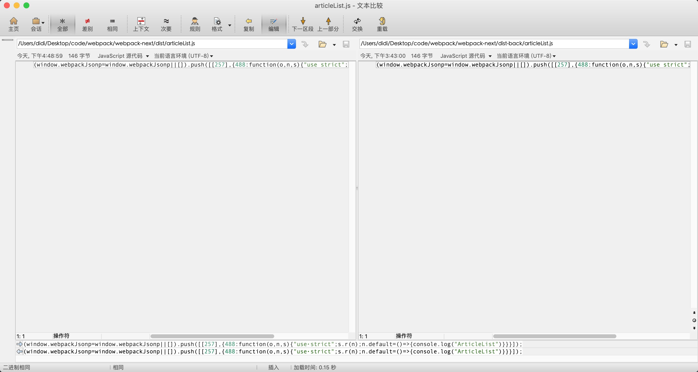

## 前言
想必经常使用基于webpack打包工具的框架的同学们，无论是使用React还是Vue在性能优化上使用最多的应该是分包策略（按需加载）。按需加载的方式使我们的每一个bundle变的更小，在每一个单页中只需要引入当前页所使用到的JavaScript代码，从而提高了代码的加载速度。但是，由于webpack目前版本自身的原因分包策略虽然可以提高我们的加载速度，但是在线上缓存方面却给了我们极大的破坏(webpack5中解决了这个问题)。

本文主要通过以下四个方面，来深入剖析chunkId：

- chunkId是怎么生成的？
- chunkId是怎么破坏线上缓存的？
- 解决chunkId对破坏缓存的方法
- 远观未来，webpack5完美解决


## chunkId的生成策略是什么？
webpack是一个基于模块化的打包工具，其总体打包流程可分为：
1. 初始化阶段
2. 编译阶段
3. 输出阶段

**初始化阶段**

webpack初始化阶段主要在webpack.js中完成，有以下方面：

- webpack-cli启动，获取webpack.config.js配置及合并shell参数
- 根据cli得到的配置合并默认配置
- 创建compiler实例
- 遍历配置中的plugins加载第三方插件
- 初始化默认插件

**编译阶段**

初始化完成之后，cli得到compiler实例，执行compiler.run()开始编译，编译的过程主要分为以下步骤：
- 分析entry，逐一遍历
- 确定依赖模块，递归解析
- 分包策略确定每一个chunk所包含的module，合并module生成chunk。
- 确定模块资源
- 根据chunk的entry的不同，确定输出template模板。

**输出阶段**

- 输出文件

上面简单了解一下打包流程，当然最主要的目的不是为了了解打包流程，而是其中的一个点：**chunk是怎么生成的**

从编译阶段中可以看出，chunk是由多个module合并生成的，每一个chunk生成的时候都会有一个对应的chunkId，chunkId的生成策略是本节讨论的重点。

chunkId的生成策略可以在[官网](https://webpack.js.org/configuration/optimization/#optimizationchunkids)中找到，主要有五种规则：
1. false：不适用任何算法，通过插件提供自定义算法。
2. natural：自然数ID
3. named：使用name值作为Id，可读性高。
4. size：数字ID，依据最小的初始下载大小。
5. total-size：数字ID，依据最小的总下载大小。

不同的生成规则所打包出来的chunkId是不同的。但是，其实内部生成方式是一样的，不同的规则只是对chunks中的chunk排序规则不同(说的什么玩意，什么一会相同，一会不同的)。不要着急，接下来就来看一下这东西到底是怎么生成的。

我们都知道webpack的optimization中有个chunkIds的配置，上面五种值，就是它的可选值。在开发环境下默认值为named，在生产环境下默认值为size。

在webpack初始化阶段会挂载内部插件，我们直接定位到`WebpackOptionsApply.js`这个文件的第437行。
```js
if (chunkIds) {
	const NaturalChunkOrderPlugin = require("./optimize/NaturalChunkOrderPlugin");
	const NamedChunksPlugin = require("./NamedChunksPlugin");
	const OccurrenceChunkOrderPlugin = require("./optimize/OccurrenceChunkOrderPlugin");
	switch (chunkIds) {
		case "natural":
			new NaturalChunkOrderPlugin().apply(compiler);
			break;
		case "named":
			new OccurrenceChunkOrderPlugin({
				prioritiseInitial: false
			}).apply(compiler);
			new NamedChunksPlugin().apply(compiler);
			break;
		case "size":
			new OccurrenceChunkOrderPlugin({
				prioritiseInitial: true
			}).apply(compiler);
			break;
		case "total-size":
			new OccurrenceChunkOrderPlugin({
				prioritiseInitial: false
			}).apply(compiler);
			break;
		default:
			throw new Error(`webpack bug: chunkIds: ${chunkIds} is not implemented`);
	}
}
```
上面代码中可以看到，在初始化阶段不同的chunkIds的值会加载不同的插件，并且进入这个插件内部你会发现他们都是挂载到`compilation.hooks.optimizeChunkOrder`这个钩子上。那么疑问来了，这个钩子是在什么时机执行的呢？定位到``compilation.js`的第1334行会得到答案。
```js
//这个钩子主要做的是确定以什么规则生成chunkId
this.hooks.optimizeChunkOrder.call(this.chunks);
//生成前所要做的事，注：我们可以在这里做手脚
this.hooks.beforeChunkIds.call(this.chunks);
//生成chunkId
this.applyChunkIds();
this.hooks.optimizeChunkIds.call(this.chunks);
this.hooks.afterOptimizeChunkIds.call(this.chunks);
```
在执行流程中可以看出，chunkId在生成前确定生成规则。可能你的疑问又来了，它是怎么根据chunkId的值的不同生成规则呢？其实所有的chunk都存放在一个数组里面(也就是chunks)，在`optimizeChunkOrder`中根据规则的不同对chunk进行相应的排序，然后再`applyChunkIds`统一的对`chunk.id`进行赋值。眼见为实，我们先来看一下applyChunkIds中是怎么赋值的,定位到compilation.js中的1754行。
```js
let nextFreeChunkId = 0;
for (let indexChunk = 0; indexChunk < chunks.length; indexChunk++) {
	const chunk = chunks[indexChunk];
	if (chunk.id === null) {
		if (unusedIds.length > 0) {
			chunk.id = unusedIds.pop();
		} else {
			chunk.id = nextFreeChunkId++;
		}
	}
	if (!chunk.ids) {
		chunk.ids = [chunk.id];
	}
}
```
这生成过程中判断chunk.id是否为null，如果为null，对id赋值nextFreeChunkId。没错，无论是什么生成规则，都是这样赋值的。明白了所有的生成规则都是使用相同的赋值规则之后，我们现在的疑问应该就是每个规则中是怎么对chunks进行排序的？接下来就来看一下每个规则是怎么做的。

### natural
在`WebpackOptionsApply.js`中我们可以知道，chunkIds值为natural的时候，挂载的是`NaturalChunkOrderPlugin`这个插件。
```js
compilation.hooks.optimizeChunkOrder.tap(
	"NaturalChunkOrderPlugin",
	chunks => {
	    //排序
		chunks.sort((chunkA, chunkB) => {
		    //得到modulesIterable的iterator遍历器
			const a = chunkA.modulesIterable[Symbol.iterator]();
			const b = chunkB.modulesIterable[Symbol.iterator]();
			while (true) {
				const aItem = a.next();
				const bItem = b.next();
				if (aItem.done && bItem.done) return 0;
				if (aItem.done) return -1;
				if (bItem.done) return 1;
				//获取到module的id
				const aModuleId = aItem.value.id;
				const bModuleId = bItem.value.id;
				if (aModuleId < bModuleId) return -1;
				if (aModuleId > bModuleId) return 1;
			}
		});
	}
);
```
首先，在每一个chunk中都有一个`modulesIterable`这个属性，它是一个`Set`,里面存放的是所有合并当前的module，每个module的id属性表示当前module的`相对路径`。`NaturalChunkOrderPlugin`主要做的事就是根据moduleId来最为排序规则进行排序。

### named
named的生成规则比较简单，根据chunk的name取值
```js
class NamedChunksPlugin {
	static defaultNameResolver(chunk) {
		return chunk.name || null;
	}
	constructor(nameResolver) {

		this.nameResolver = nameResolver || NamedChunksPlugin.defaultNameResolver;
	}
	apply(compiler) {
		compiler.hooks.compilation.tap("NamedChunksPlugin", compilation => {
			compilation.hooks.beforeChunkIds.tap("NamedChunksPlugin", chunks => {
				for (const chunk of chunks) {
					if (chunk.id === null) {
						chunk.id = this.nameResolver(chunk);
					}
				}
			});
		});
	}
}
```
named与其他方式的区别在于，named不是在`optimizeChunkOrder`中对chunkId操作，而是在beforeChunkIds阶段。`NamedChunksPlugin`所做的事是遍历所有的chunk，判断chunk的id值是否为null，如果为null，取到chunk的name值赋予id。

当执行`applyChunkIds`的时候，由于当前的id值已经不是null了，所以跳过赋值规则，直接使用已存在的值。

### size和total-size
size和total-size规则由于调用的是相同的插件，只是参数的不同，所以我们就一起看一下它是怎么做的。打开`OccurrenceChunkOrderPlugin.js`文件。

**size和total-size**调用插件的区别：
1. size规则：prioritiseInitial为true。
2. total-size规则：prioritiseInitial为false。

```js
apply(compiler) {
	const prioritiseInitial = this.options.prioritiseInitial;
	compiler.hooks.compilation.tap("OccurrenceOrderChunkIdsPlugin",compilation => {
		compilation.hooks.optimizeChunkOrder.tap("OccurrenceOrderChunkIdsPlugin",chunks => {
			const occursInInitialChunksMap = new Map();
			const originalOrder = new Map();
			let i = 0;
			for (const c of chunks) {
				let occurs = 0;
				//得到chunk的chunkGroup
				for (const chunkGroup of c.groupsIterable) {
				    //查看当前模块有没有被其它模块引用
					for (const parent of chunkGroup.parentsIterable) {
					    //isInitial方法始终返回true
						if (parent.isInitial()) occurs++;
					}
				}
				occursInInitialChunksMap.set(c, occurs);
				originalOrder.set(c, i++);
			}
			//排序
			chunks.sort((a, b) => {
			    //如果规则是size，prioritiseInitial为true，通过父模块的数量来排序。如果父模块相同，则按照和total-size相同的规则排序。
				if (prioritiseInitial) {
					const aEntryOccurs = occursInInitialChunksMap.get(a);
					const bEntryOccurs = occursInInitialChunksMap.get(b);
					if (aEntryOccurs > bEntryOccurs) return -1;
					if (aEntryOccurs < bEntryOccurs) return 1;
				}
				//得到groups的大小，内部调用this._group.size
				const aOccurs = a.getNumberOfGroups();
				const bOccurs = b.getNumberOfGroups();
				if (aOccurs > bOccurs) return -1;
				if (aOccurs < bOccurs) return 1;
				//依据chunk在chunks中的索引位置排序
				const orgA = originalOrder.get(a);
				const orgB = originalOrder.get(b);
				return orgA - orgB;
	    	});
		});
	});
}
```
OccurrenceChunkOrderPlugin通过prioritiseInitial区分是size还是total-size：
- prioritiseInitial为true：根据父模块的数量排序，如果数量相同走total-size的逻辑。
- prioritiseInitial为false：首先根据chunk的groups的数量排序，如果数量相同，根据chunk所在的索引排序。

### 小结
1. 首先我们会发现除了named之外的规则都是生成的number值，并且只是在生成chunkId前，对chunks以不同的规则进行排序。
2. 通过named规则，我们可以发现，如果在beforeChunkIds中给chunkId赋值，那么就会阻截默认的规则。

## chunkId是怎么破坏线上缓存的？
说到破坏，我们心中可能又会有疑问，这东西怎么会**破坏**线上缓存呢？我们来模拟一个场景。

想必业务思想很好的你，有时候也会让业务的快速变更搞的非常烦恼，假设一个blog项目三个功能模块：文章列表页、文章标签页、关于页，并且三个功能模块都是异步的。我们来简写一下代码。

首先入口文件为index.js，三个功能模块代码为articleList.js、articleTag.js、about.js。
```js
//三个功能模块的代码如下：
//articleList.js
const ArticleList = () => {
  console.log('ArticleList')
}

export default ArticleList
//articleTag.js
const ArticleTag = () => {
  console.log('ArticleTag')
}

export default ArticleTag
//about.js
const About = () => {
  console.log('About')
}

export default About;
```
在index.js中异步引入这三个功能模块。
```js
// 引入articleList
import('./articleList').then(_ => {
  _.default()
})

// 引入articleTag
import('./articleTag').then(_ => {
  _.default()
})

// 引入about
import('./about').then(_ => {
  _.default()
})
```
我们使用生产环境打包一下，得到dist目录中的文件如下：



很完美，打包成功，结果也肯定和我们想的一样。

假如有一天，需求变了，关于我们页不想要了，让它暂时不存在项目里面了(为了方便文件的diff，我们先把当前的代码做一个备份)，我们可以先把About的代码在index.js中的代码注释。
```js
// 引入articleList
import('./articleList').then(_ => {
  _.default()
})

// 引入articleTag
import('./articleTag').then(_ => {
  _.default()
})

// 引入about
//import('./about').then(_ => {
//  _.default()
//})
```
注释之后，重新打包。重新生成的文件和备份的如下



打包结果如我们所想，一切都很平静，但是殊不知平静的背后正在掀起大浪。我们来使用一个比较工具文件内容比较工具---Beyond Compare，选取dist中和备份中的1.js文件来做一下比较。

哇，你会发现，除了webpack的运行代码之外，其它的都不一样了，如果这样把代码抛到线上，这也就意味着在About的chunkId后异步chunk线上缓存都将失效。

可以你会说，这不小意思吗？我有webpack的魔法注释，不让文件名变不就得了。(此时作者只能呵呵一笑)我们来验证一下。

我们来把index中引入的三个模块都加上魔法注释：
```js
// 引入articleList
import( /* webpackChunkName: "articleList" */'./articleList').then(_ => {
  _.default()
})

// 引入articleTag
import( /* webpackChunkName: "articleTag" */ './articleTag').then(_ => {
  _.default()
})

// 引入about
import( /* webpackChunkName: "about" */ './about').then(_ => {
  _.default()
})
```
打包结果如下


我们把当前dist备份，再把about注释，重新打包结果为


我们来选择articleList来比较一下，打开Beyond Compare，选择dist和备份中的articleList文件。


呵呵，主要内容确实没有变化，但是我们的chunkId变了，那么文件内容也变了，缓存失效。

### 小结
1. 按需加载可以使单个js文件的代码量更小、加载更快，但是带来优化的同时也对缓存产生了极大的伤害。
2. 缓存是性能优化中极为重要的部分，罪魁祸首在chunkId，所以必须盘它。

## 解决chunkId对破坏缓存的方法
相信上述问题，早已被社区的同学们发现，笔者在也曾找了一会插件，但都没有如愿，心里不服，干脆自己写一个。

[webpack-fixed-chunk-id-plugin](https://www.npmjs.com/package/webpack-fixed-chunk-id-plugin) 这个插件已经被笔者发布到npm，代码极简，可能会存在不足，还望社区大佬多多提建议，共同成长。

### 说说我的想法
根据上文我们可以得出，万物的罪魁祸首是chunkId，所以必须要固定它，才能让文件内容不会变。那如何固定呢？

**第一点**：根据上文第一部分分析chunkId生成原理的时候，我们从named这个规则中得出只要在`beforeChunkIds`，这个地方给chunkId一个值，在`applyChunKId`阶段就不会对chunkId执行定义的规则。

**第二点**：上一点得出在webpack什么阶段来控制chunkId，那么这点就应该讨论控制chunkId要基于什么来控制？ 第一个想到的肯定是内容，基于内容来控制chunkId，当内容变chunkId变、内容不变chunkId不变。

基于上面两点，插件代码如下：
```js
const crypto = require('crypto');
const pluginName = "WebpackFixedChunkIdPlugin";

class WebpackFixedChunkIdPlugin {
      constructor({hashLength = 8} = {}) {
            //todo 
            this.hashStart = 0;
            this.hashLength = hashLength;
      }
      apply(compiler) {
            compiler.hooks.compilation.tap(pluginName, (compilation) => {
                  compilation.hooks.beforeChunkIds.tap(pluginName, (chunks) => {
                        chunks.forEach((chunk,idx) => {
                              let  modulesVal,
                                    chunkId;
                              if(![...chunk._modules].length) {
                                    modulesVal = chunk.name;
                              } else {
                                    const modules = chunk._modules;
                                    for(let module of modules) {
                                          modulesVal += module._source._value;
                                    }
                              }
                              const chunkIdHash = crypto.createHash('md5').update(modulesVal).digest('hex');
                              chunkId = chunkIdHash.substr(this.hashStart, this.hashLength);
                              chunk.id = chunkId;
                        })
                  })
            })
      }
      
}

module.exports = WebpackFixedChunkIdPlugin;
```
通过挂载到beforeChunkIds钩子上，拿到所有的chunk，遍历每一个chunk得到所有合并当前chunk的module的内容，使用node的crypto加密模块，对内容计算hash值，设置`chunk.id`。下面我们来测试一下，这个插件好不好用。
```js
//下载插件：npm install webpack-fixed-chunk-id-plugin
const WebpackFixedChunkIdPlugin = require('webpack-fixed-chunk-id-plugin');
module.exports = {
    plugins: [
    new WebpackFixedChunkIdPlugin()
    ]
}
```
打包一下查看结果：

在打包日志的我们发现，Chunks那里变成了一串hash值，这就是根据module内容计算出的hash值。我们再把about功能模块注释，打包一下，并查看结果。


没有报红，减少一个模块并不会影响其他模块，完美。

### 小结
1. 根据打包问题，确定事故发生地点---chunkId。
2. 根据事故发生时机，找出阻截事故发生方案---beforeChunkIds。
3. 定制可行方案---基于module内容来生成唯一hash。

## 远观未来，webpack5完美解决
chunkId事故问题可谓webpack自身留下的坑，chunkId方便了开发者，同样chunkId也对我们造成了极大的破坏，正所谓：成也chunkId、败也chunkId。

**webpack4中遗留的问题，在还未现世的webpack5中得到了完美的解决。**

接下来开始尝鲜webpack5。由于webpack5还未发版，我们可以通过一些方法来使用它。
```js
//下载webpack5
npm init -y
npm install webpack@next --save-dev
npm install webpack-cli --save-dev
```
把webpack4中的src下的代码拷贝到webpack5中打包，结果如下：


由上图结果可见，Chunks栏都变成了一个确定的数字值，并且`可能`(接下来论证)是不受其他chunk影响的。

我们来按照之前的方式验证一下，把about模块注释，并使用Beyond Compare比较一下。


没有影响，webpack5完美的解决了这个问题。

虽然webpack5可以执行以上操作，但是由于目前还未发布，以cli的配合并不完善。目前的版本，只要写webpack.config.js使用cli启动就会报错，如果要使用配置文件的话就只能使用node来启动webpack。

并且如果要使用webpack5完美的chunkId，还需要在webpack配置文件中配置一下内容：
```js
module.exports = {
    optimization: {
        chunkIds: 'deterministic',
    }
}
```
### 小结
目前的webpack5已经有了很多优秀的特性，包括代码也变的更加简介，总之，拥抱webpack5吧。

## 总结
我们在开发过程中关注甚少的chunkId竟能引发这个大的问题，所以个人认为不仅是在学习还是在深入研究的过程中都要抱有疑问或是怀疑态度，促使我们去挖掘原理，只有明白真正内部实现的时候，才能完全的相信它，这也是我的一种自我提升的方式。