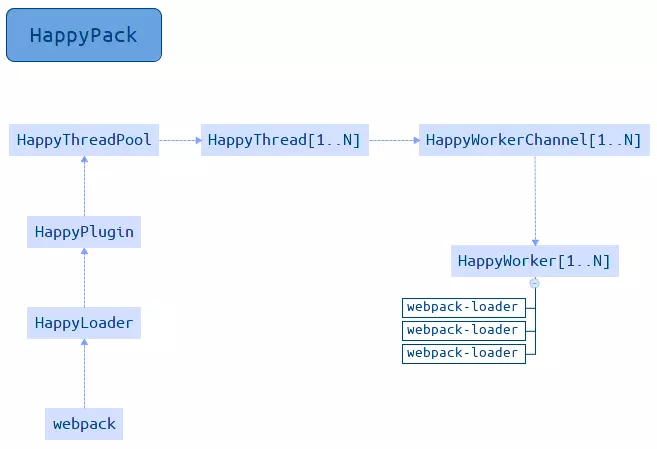

## webpack 的痛点

### one：进退两难的 loader

众所周知，webpack 打包一切，万物皆模块，成就 webpack 特性的根本就是 loader，webpack 使用 loader 加载各种文件，例如加载一个 loader：loader 首先接收到的是 string，通过 loader 解析把 string 解析成 AST，然后经过一系列处理再转成 string。所以说一个 loader 的编译是经历了`String->AST->String`的过程。

上面说了 webpack 万物皆模块的优点。虽然它为我们带来了许多便利，但是它也成为了我们构建项目过程中的一个痛点，经历一个 loader 就会经历`String->AST->String`的过程，那经历三个 loader(less-loader--->css-loader--->style-loader)呢？

> less-loader(String->AST->String) --> css-loader(String->AST->String) --> style-loader(String->AST->String)

看到这个过程，你可能会想，这 webpack 是不是傻，直接第一次转成 AST，后面的 loader 都使用这个 AST，到最后一个再转成 String 不就行了吗？很明显 webpack 没有你那么聪明，这也是它痛点的原因。

### two：孤独的人生路

何为孤独人生路？webpack 是基于 node.js 来做的构建工具，其 node 本身只是一个运行时，代码还是用 JavaScript 来写的，当然也就继承了单进程单线程这一特点。webpack 基于 node，当然它也是单进程单线程的了。

对比传统的多进程多线程后端语言，node 虽然不需要管理多线程之间各种锁的问题，但它也有光杆司令的忧伤。

> webpack 相比也内心吐槽，我一个线程程力(人叫人力，线程就叫程力吧)，哪能比过人家一群程力的力量。

## 有痛点必然有解痛药

> 心病还得心药医，止痛还需解痛药

### one：一解 loader 勇往直前

既然 loader 每次都要经历这么一个过程，那么我缓存不就可以了吗？

目前来说使用最多的就是`cache-loader`。

安装

> npm install cache-loader --save-dev or yarn add cache-loader --dev

`cache-loader`的使用方式很简单，想缓存哪个 loader，只需要在特定 loader 的前面加上`cache-loader`就可以了

```js
module.exports = {
  module: {
    rules: [
      {
        test: /\.css$/,
        use: [
          {
            loader: 'cache-loader'
          },
          {
            loader: 'style-loader'
          },
          {
            loader: 'css-loader'
          },
          {
            loader: 'less-loader'
          }
        ]
      }
    ]
  }
}
```

这样 loader 的问题就很轻松的解决了。

### two：二解多实例并行前行

目前 webpack 上多线程多实例的方式有很多种，主要分为编译多实例和压缩多实例两个方面。

#### 编译多实例

##### happypack

编译多实例相信听到最多的应该是 happypack 这个东西，开启多线程进行 loader 编译。

安装

> npm install happypack --save-dev or yarn add happypack --dev

使用方式(引用一下 npm 上的例子)

```js
const HappyPack = require('happypack')
module.exports = {
  module: {
    rules: [
      {
        test: /\.js$/,
        use: 'happypack/loader'
      }
    ]
  },
  plugins: [
    new HappyPack({
      loaders: ['babel-loader?presets[]=es2015']
    })
  ]
}
```

happypack 其原理就是：每次 webpack 解析一个模块，happypack 会将它及依赖分配给 worker 线程中编译。下面是 happypack 整体流程图。


##### thread-loader

现在 webpack4 已经不推荐使用 happypack 了，而是推荐使用 thread-loader，thread-loader 的原理和 happypack 类似， 其不同的地方是 thread-loader 可以人为设置对于哪种 loader 使用多少个线程来编译。

安装

> npm install thread-loader --save-dev or yarn add thread-loader --dev

使用方式：

```js
module.exports = {
  module: {
    rules: [
      {
        test: /\.js$/,
        use: [
          {
            loader: 'thread-loader',
            options: {
              workers: 4
            }
          },
          {
            loader: 'babel-loader'
          }
        ]
      }
    ]
  }
}
```

上面 thread-loader 使用 workers 配置了 4 个线程来编辑 js 文件。

#### 压缩多实例

##### uglify-webpack-plugin

第一种方式就是使用 webpack 内置的`uglify-webpack-plugin`这个插件，只需要配置一个 parallel 参数就可以，parallel 参数默认为当前电脑的 cpu 的核心数(os.cpus().length - 1)

```js
const UglifyJsPlugin = require('webpack/uglify-webpack-plugin')
module.exports = {
  optimization: {
    minimizer: [
      new UglifyJsPlugin({
        parallel: true
      })
    ]
  }
}
```

##### terser-webpack-plugin

目前 webpack 的压缩使用的是这个插件，原因很简单：`uglify-webpack-plugin`压缩不了 ES6 的语法，而`terser-webpack-plguins`可以，并且在`terser-webpack-plguins`内部默认开启了缓存和多进程压缩。

安装

> npm install terser-webpack-plugin --save-dev or yarn add terser-webpack-plugin --dev

使用方式：和`uglify-webpack-plugin`一样 parallel 默认值为当前电脑的 cpu 核心数(os.cpus().length -1 )

```js
const TerserPlugin = require('terser-webpack-plugin')
module.exports = {
  optimization: {
    minimize: true,
    minimizer: [
      new TerserPlugin({
        parallel: true
      })
    ]
  }
}
```

## 总结

上面总结的一些解决方案，基本上可以大幅度提高我们开发过程中的编译速度。
